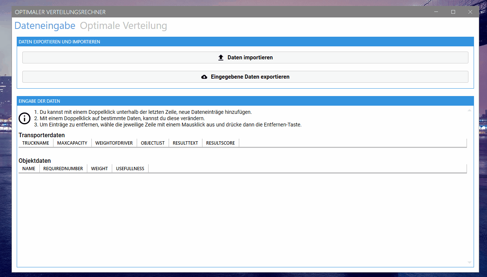

# Multiple Knapsack Solver🎒
Solves the multiple knapsack problem with a greedy algorithm.

This program was originally intended for a coding challenge of GetInIT GmbH and BWI, but can also be useful for productive use.
## Preview


## Clone🔄
> You need at least Visual Studio 2019

- Enter the following command
  
  ```shell
  $ git clone https://github.com/CodingTarik/Multiple-Knapsack-Solver.git
  ```
## License📜

